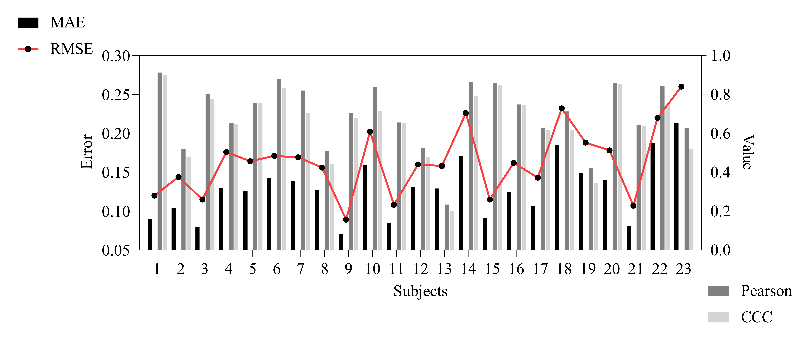

**中文** | [English](./README.md)

# SEED-VIG Transformer

## 简介

基于SEED-VIG数据集，端到端训练Transformer，实现严格LOSO下的警觉度（PERCLOS）回归预测。

## 运行

1.数据集获取：https://huggingface.co/datasets/Curryjiang/SEED-VIG

2.将原始EEG存放至：Raw_Data\mat_data，EOG存放至：Raw_Data\perclos_labels

3.执行脚本process.py，Data获取批处理后npy文件

4.执行脚本Run.py，进行超参数优化、训练、验证、及LOSO评估

参数可于Configs配置

## 模型

1.深度可分离卷积（eeg/eog）
2.动态门控+模态随机丢弃
3.跨模态多头注意力（eeg查询eog）融合
4.自注意力+RoPE编码
5.FDS和LDS自主校准
6.回归头预测

## 流程

1.将23受试者划分18训练、5人验证，利用Optuna进行超参数搜索（trial=100）（于Configs\config.json调整搜索范围）

2.将23受试者依次划分22人训练、1人测试（epoch=1），实现严格LOSO验证，其中

阶段1：整体模型训练，开启CORAL 协方差对齐损失，epoch=200，早停机制

阶段2：冻结Backbone仅训练回归头，开启FDS和LDS自主校准，epoch=20，早停机制

## 数据

eeg.npy shape [885000, 4]

eog.npy shape [885000, 2]

label.npy shape [885, 1]

按原论文选取仅额头4电极位（4，5，6，7），且取反ch6。对原始通道数据进行峰度与相关性等质量评估；结合通道减法与独立成分分析（Fast ICA）分离出垂直与水平眼电（VEOf/HEOf）特征；通过计算自适应皮尔逊相关系数阈值，识别并剔除EEG独立成分中的眼电伪影以重构纯净脑电（可于ica.json手动剔除伪影）；对清洗后的EEG与EOG执行带通滤波、极值裁剪及Z-score标准化，并同步提取PERCLOS标签，输出可直接用于多模态回归模型训练的对齐数据集。

## 结果

| **LOSO指标** | **均值 (Mean)** | **标准差 (SD)** | **标准误 (SEM)** | **95%置信区间下限** | **95%置信区间上限** | **最小值 (Min)** | **最大值 (Max)** |
| ------------ | --------------- | --------------- | ---------------- | ------------------- | ------------------- | ---------------- | ---------------- |
| **MAE**      | 0.1287          | 0.0377          | 0.0079           | 0.1124              | 0.1450              | 0.0700           | 0.2130           |
| **RMSE**     | 0.1636          | 0.0442          | 0.0092           | 0.1445              | 0.1827              | 0.0890           | 0.2600           |
| **Pearson**  | 0.6955          | 0.1700          | 0.0354           | 0.6220              | 0.7690              | 0.2340           | 0.9120           |
| **CCC**      | 0.6515          | 0.1739          | 0.0363           | 0.5763              | 0.7267              | 0.2020           | 0.9000           |



## 依赖

| 库 | 用途 |
|---|---|
| `numpy` | 数值计算 |
| `scipy` | .mat 文件加载、峰度/相关系数统计 |
| `pandas` | 结果 CSV 导出 |
| `mne` | EEG 处理（滤波、ICA 拟合与重构） |
| `scikit-learn` | 回归指标（MAE/RMSE）及 FastICA |
| `torch` | 模型定义与训练 |
| `safetensors` | 模型权重安全序列化 |
| `optuna` | 超参数搜索 |

安装：

```bash
pip install numpy scipy pandas mne scikit-learn torch safetensors optuna
```

## 许可

### 数据集

SEED-VIG 数据集版权归上海交通大学 BCMI 实验室所有，仅限**非商业研究用途**。使用该数据集须引用以下论文：

> Wei-Long Zheng and Bao-Liang Lu, *A multimodal approach to estimating vigilance using EEG and forehead EOG*, Journal of Neural Engineering, 14(2): 026017, 2017.

数据集申请地址：https://bcmi.sjtu.edu.cn/~seed/seed-vig.html

### 本项目代码

Apache-2.0 license — 详见 [LICENSE](LICENSE) 文件。